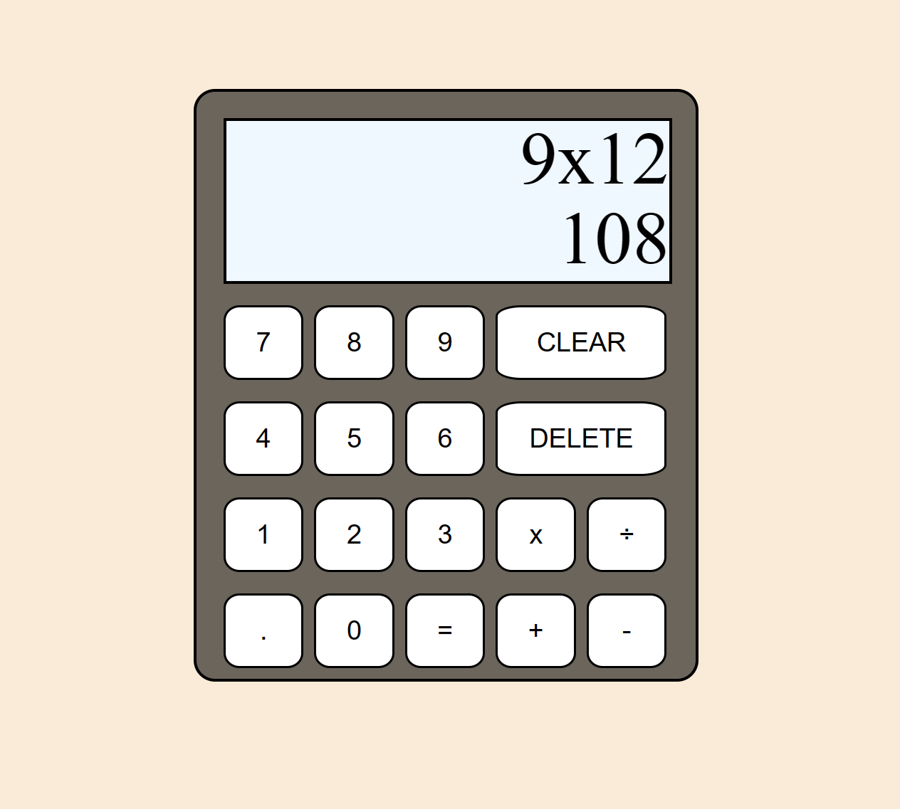

This is a basic calculator website.
What can you do?
- Addition 2 numbers
- Subtraction 2 numbers.
- Multiplication 2 numbers.
- Division 2 numbers.
Feature ideas to implement:
- Allow multiple numbers.
- Save the previous result.

